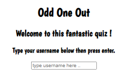
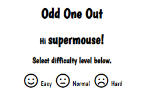
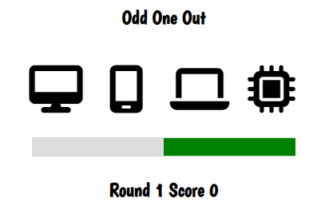
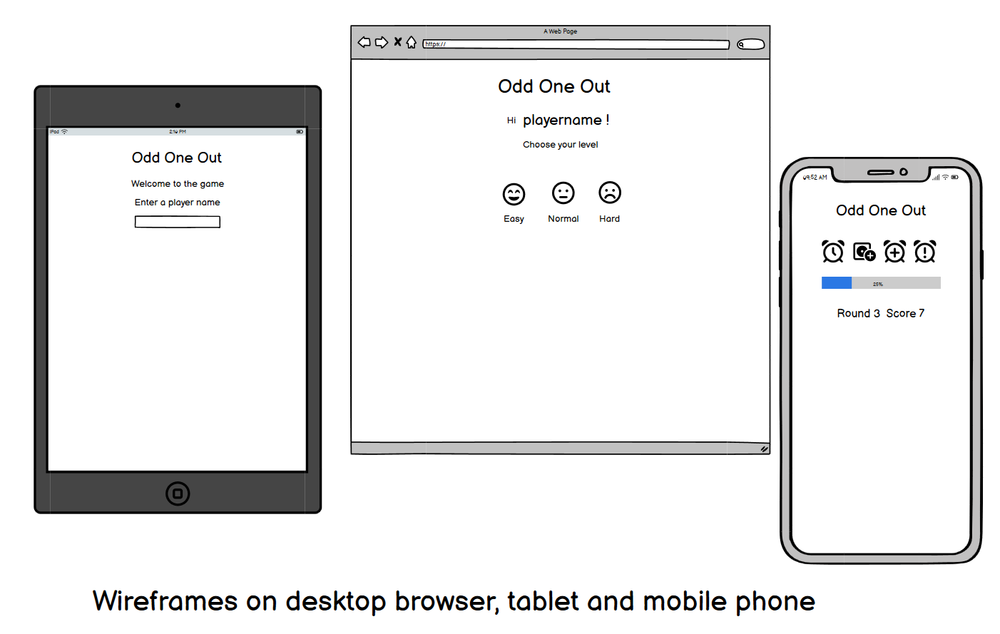
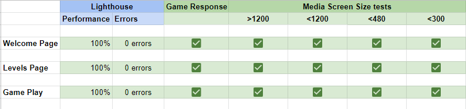

# <h1>Odd One Out/h1>

 

 

## <h1>Table of Contents</h1>

 

- [Introduction](#introduction)
  + 
- [Goals](#goals)
  + [Personal Goals](#personal-goals)
  + [Player Goals](#player-goals)
- [Design and Planning](#design-and-planning)
  + [Color](#color)
  + [Fonts](#fonts)
  + [Structure](#structure)
  + [Features](#features)
  + [Wireframes](#wireframes)
  + [Languages and Technologies](#languages-and-technologies)
- [Testing](#testing)
  + [Performance](#performance)
  + [Validation](#validation)
  + [Reponsiveness](#responsiveness)
- [Game Testing](#game-testing)
- [Acknowledgements](#acknowledgements)

 
 

## <h1>Introduction</h1> 

This is a neat little game based on old fasioned quiz book type puzzles.

 
 

## <h1>Goals</h1> 

### <h2>Personal Goals</h2>

 

Create a game that challenges and entertains the player.
I added a progress par to add an element of excitement.

 

### <h2>Player Goals</h2>

 

Test logic and hand eye coordination skills in a fun way.

 
 

## <h1>Design and Planning</h1> 

I drew a rough sketch on paper first with some notes to explain how the game works. It was my intention to design all the icons by hand but I decided to utilize font awesome icons instead as they were simple and clear, suited the game itself, and saved an enormous amout of time which would have benn spent designing an creating the icons from scratch. Having said that, a future enhancement would utilize hand made icons and also various quizzes testing user knowledge on everything from art to sport using the same odd one out format. So one example might be to choose which is the odd one from a choice of modern, surrealist, abstract-expressionst and renaissance paintings. Or three Warhol's and onother similiar artwork etc.
 

### <h2>Color</h2> 

I chose a basic black and white scheme to fit in with the quiz book idea. 
 

### <h2>Fonts</h2> 

I chose a Boogaloo Google Font for its playful and jokey style. 

 

### <h2>Structure</h2> 

The initial weclome screen is simple but intuitive which invites the play to create a username once entered allows the player to select a difficulty level leading on to the game play area itself.

I stayed with a basic linear game play area which is simple an intuitive requiring no additional help or information for the player. The progress bar is right below the play area but close enough to theplayers field of vision to give an added sense of excitement to the play. 

 

### <h2>Features</h2> 

 * Player username input
 * Level Selection
 * Progress bar
 * Player feedback
 * Score display
 * Win and lose audio samples

 

### <h2>Wireframes</h2> 

Wireframes

 

### <h2>Languages and Technologies</h2> 

[Balsamiq](https://balsamiq.com/) was used to create the wireframes.

[Google Fonts](https://fonts.google.com) was used for the Boogaloo font.

[Fontawesome](https://fontawesome.com) was used for the social media icons.

[CSS](https://en.wikipedia.org/wiki/CSS) CSS for the design and some media.

[JS](https://en.wikipedia.org/wiki/JavaScript) Javascript for the game functionality.

 
 

## <h1>Testing</h1> 

 

### <h2>Performance</h2> 

I used developer tools in Chrome and Firefox during development in order to continuouly gauge performance and responsiveness. The following hardware was used to test real life performance.

#### Devices Used

* Desktop PC  
* Macbook Pro
* Macbook Air
* Lenovo Yoga
* Huawei P20 

I tested the site using various browsers on the differnet devices.

#### Browsers Used

* Microsoft Edge
* Safari
* Google Chrome
* Mozilla Firefox
* Opera
 

### <h2>Validation</h2> 

*  [HTML Validator](https://validator.w3.org/) was used throughout the project to test for errors. 

Empty heading errors. This is by design as the text will be entered programatically during game play.
Four "Attribute odd-flag not allowed on element button at this point". This is also by design as the game needs to allocate a value to thsi attribute in order to determin which is the odd one out. 

* [CSS Validator](https://validator.w3.org/) used to check for and correct errors. There are currently no errors in the code as currently submitted.

No errors were detected in the CSS validator.
 

### <h2>Responsiveness</h2> 

* [Lighthouse](https://developer.chrome.com/en/docs/lighthouse/) in Chrome Developer Tools was used to check performance. 

100% on all checks.

 
 

## <h1>Game Testing</h1> 

I tested the game myself and alos invited friends and family members to do the same. Cosmetic issues with responses to the player were all resolved during the game testing. There are no outstanding issues or errors with the game.

 

### <h2>Test chart to ensure website works as expected</h2>

All pages were tested with the visitor in mind in terms of accessiblity, presentation, responsiveness and performance. All links were tested to ensure functionality. Below is a simpe chart of the results.

 
 
 

## <h1>Acknowledgements</h1>

Thanks to the following people who have supported me:

  + My mentor Gaff (Naoise Gaffney)
  + Ed Bradley and David on the #ask-us-anything channel
  + My wife Tricia
  + LWETB and Code Institute for the opportunity to do this

